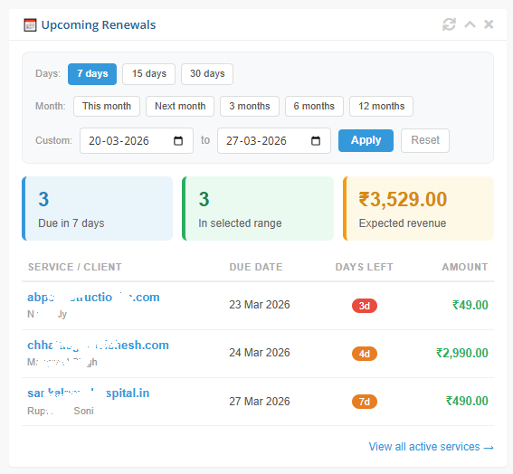

# 📅 WHMCS Upcoming Renewals Widget

A free, open-source WHMCS dashboard widget that gives you an instant view of upcoming renewals and expected revenue — right from your admin dashboard. No paid addons, no extra modules.



---

## 😩 The Problem

WHMCS has no built-in way to see upcoming renewals and expected revenue at a glance. You have to manually dig through Reports every time — which wastes time for every hosting business.

## ✅ The Solution

This widget adds a clean, interactive panel to your WHMCS dashboard showing everything you need in seconds.

---

## ✨ Features

- 📊 **Summary cards** — Renewals due in 7 days, within selected range, and total expected revenue
- 📋 **Renewals table** — Domain, client name, due date, days left, and amount
- ⚡ **Quick filters** — 7 days, 15 days, 30 days, This Month, Next Month, 3 / 6 / 12 months
- 📅 **Custom date picker** — Select any From & To date range
- 🔴 **Urgency badges** — Red (≤3 days), Orange (≤7 days), Green (safe)
- 🔗 **Direct links** — Click any domain to go straight to the client's service page
- 🔄 **No page reload** — Uses WHMCS's built-in `refreshWidget()` for instant updates

---

## 📦 Installation

1. Download `UpcomingRenewals.php`
2. Upload it to your WHMCS server:
```
   /path/to/whmcs/modules/widgets/UpcomingRenewals.php
```
3. Go to your **WHMCS Admin Dashboard**
4. Click the **⚙ gear icon** (top right) → **Show/Hide Widgets**
5. Check **"Upcoming Renewals"** and it will appear on your dashboard

That's it — no database changes, no configuration needed.

---

## 🖥️ Requirements

- WHMCS 7.0 or higher
- PHP 7.2 or higher

---

## 📸 Screenshot


---

## 🗂️ File Structure
```
whmcs-upcoming-renewals-widget/
├── UpcomingRenewals.php   # The widget file
├── screenshot.png         # Preview image
├── README.md              # This file
└── LICENSE                # MIT License
```

---

## 🤝 Contributing

Contributions are welcome! Feel free to:
- Open an **Issue** for bugs or feature requests
- Submit a **Pull Request** with improvements

---

## 📃 License

This project is licensed under the **MIT License** — free to use, modify, and distribute.

---

## ⭐ Support

If this widget saves you time, please consider giving it a ⭐ on GitHub — it helps others find it!

Made with ❤️ for the WHMCS community.
```


